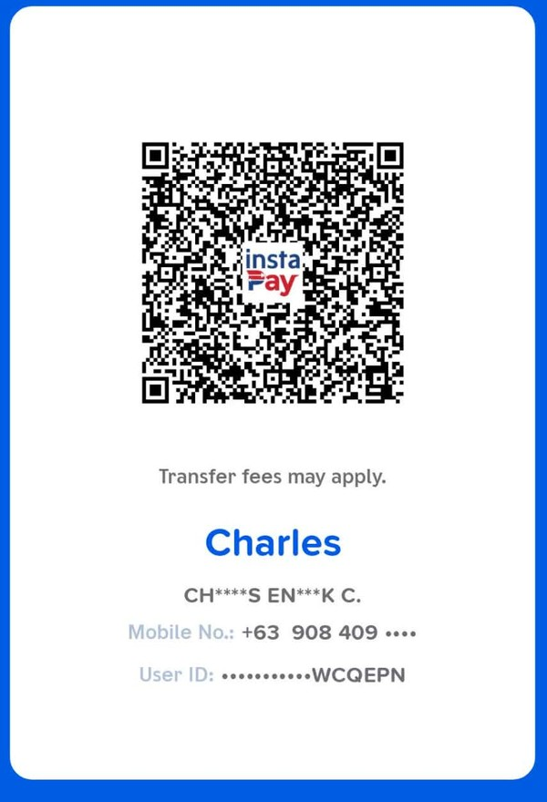

# RTNW Headwear Codex

A free, browser-based crafting tracker for headwear — hats, masks, and trinkets — in **Ragnarok: The New World**. Enter what dolls, element cores, and coin you're holding, and instantly see what you can craft right now, what you're missing, and how close you are to finishing every headwear item across all six towns.

**Live app:** [https://cajancharles.github.io/RONWHeadwearTracker/](https://cajancharles.github.io/RONWHeadwearTracker/)

Created by [@CharlesPlaysGG](https://www.youtube.com/@CharlesPlaysGG)

---

## Features

- **Six towns, one codex** — Prontera, Morroc, Alberta, Payon, Geffen, and Izlude each get their own tab, plus an "All Towns" view, so you can track your whole headwear collection or focus on one town at a time
- **Codex progress tracker** — a running count and progress bar (e.g. `2 / 44 crafted`) for the whole codex, with a matching per-town count on each tab
- **My Stockpile** — one place to enter everything you're holding:
  - **Advance Coin** — the coin used to pay crafters
  - **Element Cores** — Fire, Water, Wind, Earth, Poison, Ghost, Shadow, Neutral, and Undead
  - **Dolls** — every farmable doll used in headwear recipes (Baphomet, Bigfoot, Chonchon, Familiar, Goblin, Lunatic, Mantis, Marina, Marina Jr., Metaller, Muka, Mummy, Nine Tail, Orc Baby, Peco Peco, Picky, Poring, Savage Babe, Sidewinder, Smokie, Soldier Skeleton, Spore, Whisper, Yoyo, Zombie, and more)
  - Every item card below updates automatically as you type — no need to hit save or refresh
- **Per-item requirement cards** — each headwear item shows exactly what it costs to craft:
  - Whether a **blueprint** is required, and its "not yet" / owned status
  - The **doll** it's made from, with your current amount vs. the amount needed — shown as "spare" when you have enough, or "need X more" when you don't
  - The **element core** it binds, with the same have/need breakdown
  - The **Advance Coin** cost, with the same have/need breakdown
- **Crafted tracking** — mark an item as crafted and it gets a checkmark and a strikethrough title, so your codex progress and "done" list are always clear at a glance
- **Craftable now filter** — toggle on to instantly see only the items you have enough of everything for, right now
- **Blueprint only filter** — toggle on to see just the items that require a blueprint you haven't picked up yet
- **Search** — find any headwear item or doll by name instantly
- **Everything saves automatically** — no login, no server, no setup. Your stockpile and crafted progress are saved right in your browser
- **Your data stays yours** — nothing is uploaded anywhere; see [Data & Privacy](#data--privacy) below

## How to Use

### 1. Enter your stockpile
Open **My Stockpile** and fill in what you're currently holding — your Advance Coin, each Element Core, and each Doll. Every item card on the page below recalculates automatically as you type.

### 2. Browse by town
Use the tabs at the top (**All Towns**, **Prontera**, **Morroc**, **Alberta**, **Payon**, **Geffen**, **Izlude**) to see the headwear items for that town, along with a live crafted count for each.

### 3. Check what you need
Each item card shows its blueprint requirement (if any), the doll and element core it needs, and the coin cost — each with a have/need breakdown so you know exactly what's left to farm.

### 4. Filter down to what matters
- Turn on **Craftable now** to see only the items you can make with what you've already entered
- Turn on **Blueprint only** to see only items still waiting on a blueprint
- Use the **search bar** to jump straight to a specific item or doll

### 5. Mark items off as you craft them
Check an item off once you've crafted it — its title gets struck through and it's added to your codex progress count, both for that town and for the whole codex.

---

## Data & Privacy

This app has **no backend, no database, and no login.** Everything — your stockpile and crafted progress — is saved using your browser's local storage.

That means:

- **Your data lives only on your device**, in the browser you're using. Nobody else can see it, and it's never sent anywhere.
- **Each person who opens this app gets their own separate, empty starting point.**
- **Your data persists between visits** as long as you keep using the same browser on the same device and don't clear your browsing data.
- **Switching browsers or devices means starting over** in that new browser/device.

This project intentionally keeps things simple and serverless so anyone can use or host it for free.

---

## Self-Hosting / Forking

Want to run your own copy, or customize it for your own crafting list?

1. Fork or download this repository
2. Edit `index.html` directly — it's a single self-contained file (HTML, CSS, and JavaScript all in one)
3. Host it anywhere that serves static files: GitHub Pages, Netlify, Vercel, or just open the file locally in your browser
4. No build step, no dependencies, no server required

---

## Tech

Just plain HTML, CSS, and vanilla JavaScript. No frameworks, no build tools, no npm install. Open the file and it works.

---

## Credits

Built by [@CharlesPlaysGG](https://www.youtube.com/@CharlesPlaysGG)

- YouTube: https://www.youtube.com/@CharlesPlaysGG
- TikTok: http://tiktok.com/@charlesplaysgg
- Twitch: _(coming soon)_

## Support

If this tool saves you some grinding headaches, consider supporting the project — every bit helps keep it maintained and free for everyone.

**Crypto:**

| Currency | Address |
|---|---|
| BTC | `15zZzbk9t4Gf9xsaNJ7FqoomKmgjJyKWvE` |
| BNB (BEP20) | `0xceacfec618768e01a1dd68fe407f69f1b87162b3` |
| USDT (TRON) | `TYmZd9LntLQXs2GhK9D49Y5AehUPLadJme` |
| Solana | `o6TZyGN23P9ju2i9EuENT7XNdM5na2pmMtUq4w5ukco` |

**GCash:**

  

## Disclaimer

Not affiliated with Gravity Co., Ltd. or Ragnarok: The New World. This is an unofficial, fan-made tool.

## License

MIT — free to use, modify, and share.
